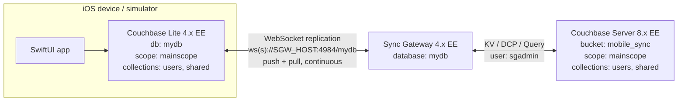

# Mobile Demo: Couchbase Lite + Sync Gateway + Couchbase Server

A SwiftUI iOS app showing **offline-first data sync** with Couchbase Lite. A traveller logs in and sees their loyalty membership, phone number and trip card. A banner message is pushed from the server. Changes sync both ways and live:

- Edit a phone number in the app, and it shows up in Couchbase Server within a second.
- Edit a document in Couchbase Server (for example the banner message), and the app's UI updates without a refresh.
- Turn on airplane mode, keep editing, and everything syncs once the device is back online.

This README covers rebuilding the whole stack from scratch: Couchbase Server, Sync Gateway and the iOS app.

---

## Quick setup with Claude Code

If you use [Claude Code](https://claude.com/claude-code), it can do the deployment for you by following this README.

1. Have the infrastructure ready (see [Requirements](#requirements)):
   - a Couchbase Server cluster with Data, Query and Index
   - an empty Linux VM for Sync Gateway
   - SSH access to that VM
   - a Mac with Xcode 26+
2. Clone this repo and run `claude` from the repo root.
3. Paste the prompt below, filling in the values in angle brackets. Leave a value blank and Claude will ask for it.

```text
I want to deploy the mobile demo in this repository into my own environment.
Read README.md completely first, then follow it step by step, verifying each
step before moving to the next one.

My environment:
- Couchbase Server web console / REST: http://<CB_HOST>:8091
- Couchbase Server admin credentials: <CB_ADMIN_USER> / <CB_ADMIN_PASSWORD>
- Couchbase Server address as seen from the Sync Gateway VM (private IP/DNS): <CB_PRIVATE_HOST>
- Number of Index nodes in the cluster: <N>
- Sync Gateway VM public address: <SGW_PUBLIC_HOST>
- SSH to the Sync Gateway VM: ssh -i <PATH_TO_KEY.pem> <SSH_USER>@<SGW_PUBLIC_HOST>
- Sync Gateway version to install: <e.g. 4.0.4 Enterprise>
- Password to use for the "sgadmin" RBAC user: <SGADMIN_PASSWORD>
- Sync Gateway app user for the iOS app: <SGW_USERNAME> / <SGW_PASSWORD>

Please:
1. Check connectivity first: Couchbase REST on 8091, SSH to the SGW VM, and
   from the SGW VM to Couchbase on 8091 and 11210. Confirm Data, Query and
   Index services are running. Stop and tell me what to open if anything is
   blocked.
2. Couchbase Server (README Step 1): create the mobile_sync bucket (choose a
   RAM quota and replica count that fit my cluster), the mainscope scope with
   the users and shared collections, the sgadmin user with the
   mobile_sync_gateway[mobile_sync] role, and load server/couchbase/seed-data.sql.
   If the bucket or any of these already exist, show me what is there and ask
   before changing or deleting anything.
3. Sync Gateway (README Step 2): install the package on the VM, write the
   bootstrap config from server/sync-gateway/sync-gateway-bootstrap.json with
   my values, start the service, create the mydb database from
   server/sync-gateway/db-config.json (set index.num_replicas below my number
   of Index nodes), and create the app user from mobile-user.json. Keep the
   Admin API on 127.0.0.1 and run admin calls over SSH.
4. Verify from my machine (README 2.5) that
   http://<SGW_PUBLIC_HOST>:4984/mydb.mainscope.users/_all_docs returns the
   seeded documents with the app user's credentials.
5. iOS app (README Step 3): fill in SyncSettings in
   MobileDemo/DatabaseManager.swift and build the app for an iOS 26 simulator
   with xcodebuild to confirm it compiles.
6. Finish with a summary: what was created, the URLs, the usernames to log in
   with, and anything you skipped or that failed.

Rules: never commit or push files that contain my hosts or passwords, never
expose port 4985 publicly, and ask me before any destructive action.
```

Claude asks for approval before running commands on your machines. Afterwards, launch the app from Xcode and log in as `alice` or `bob`.

---

## Architecture



| Layer | Name used in this demo |
|---|---|
| Couchbase Server bucket | `mobile_sync` |
| Scope / collections | `mainscope` → `users`, `shared` |
| Sync Gateway database | `mydb` |
| Sync Gateway app user | the one you create (placeholder `YOUR_SGW_USERNAME`) |
| Couchbase Server RBAC user for Sync Gateway | `sgadmin` |
| Couchbase Lite local database | `mydb` (collections created with the same scope and collection names) |

> The scope and collection names must be **identical** in Couchbase Server, the Sync Gateway database config and the app (`DatabaseManager.swift`). Replication matches collections by name.

---

## Requirements

### Couchbase Server
- **Couchbase Server Enterprise Edition**, 7.6 or later. The reference environment ran **8.0.x**.
- Services needed on the cluster, at minimum:
  - **Data**: stores the documents.
  - **Query**: Sync Gateway uses N1QL/SQL++ for its internal queries.
  - **Index**: Sync Gateway creates its own GSI indexes (`sg_allDocs_x1`, `sg_channels_x1`, …) in each collection.
  
  Search, Analytics, Eventing and Backup are **not** required.
- A single node is enough for a demo. The reference environment used 3 nodes, each running all services.
- Admin credentials (for example `Administrator` / `YOUR_CB_ADMIN_PASSWORD`).

### Sync Gateway
- **Sync Gateway Enterprise Edition 4.0** or later. The reference environment ran **4.0.4 EE** on Ubuntu 24.04.
- A separate VM or container. For a demo, 2 vCPU and 4 GB RAM is plenty.
- Network access **from Sync Gateway to Couchbase Server** on 8091–8096 and 11210. Use 18091–18096 and 11207 if you connect with TLS.
- Network access **from the mobile devices to Sync Gateway** on port **4984** (the public REST/replication port).
- Keep port **4985** (Admin API) and **4986** (metrics) closed to the internet. Call them from the Sync Gateway host itself or through an SSH tunnel.

### iOS app
- macOS with **Xcode 26** or later. The app's entry point (`MobileApp.swift`) only renders the UI on **iOS 26+**, so use an iOS 26 simulator or device.
- Swift Package Manager dependencies, resolved automatically by Xcode:
  - [`couchbase-lite-swift-ee`](https://github.com/couchbase/couchbase-lite-swift-ee) 4.0.x
  - [`couchbase-lite-vector-search-spm`](https://github.com/couchbase/couchbase-lite-vector-search-spm) 2.0.x. The app calls `Extension.enableVectorSearch()` at start-up.
- An Apple developer team, if you want to run on a physical device.

### Example cloud layout (AWS)
| Machine | Purpose | Inbound rules |
|---|---|---|
| 1–3 × EC2 (for example `m5.xlarge`) | Couchbase Server: Data + Query + Index | 8091–8096, 11210 from the SGW security group; 8091 from your IP for the web console |
| 1 × EC2 (for example `t3.medium`), Ubuntu 24.04 | Sync Gateway | 4984 from your devices or 0.0.0.0/0; 22 from your IP |

---

## Placeholders you must fill in

Nothing in this repo contains real hosts or credentials. Replace each placeholder before running:

| Placeholder | Where | What to put |
|---|---|---|
| `YOUR_CB_SERVER_HOST` | `server/sync-gateway/sync-gateway-bootstrap.json` | Hostname or **private** IP of a Couchbase Server node, as seen from the SGW host |
| `YOUR_CB_ADMIN_PASSWORD` | commands below | Your Couchbase Server `Administrator` password |
| `YOUR_SGADMIN_PASSWORD` | bootstrap config + `user-manage` command | Password of the `sgadmin` RBAC user that Sync Gateway uses to connect to the bucket |
| `YOUR_SGW_HOST` | `MobileDemo/DatabaseManager.swift` (`SyncSettings.endpoint`) | Public hostname or IP of Sync Gateway, as seen from the phone or simulator |
| `YOUR_SGW_USERNAME` / `YOUR_SGW_PASSWORD` | `server/sync-gateway/mobile-user.json` **and** `DatabaseManager.swift` (`SyncSettings`) | The Sync Gateway app user that the device authenticates as. Both files must use the same values. |

To rebrand the login screen, replace `MobileDemo/Assets.xcassets/app-logo.imageset/airline-logo.png`. This is optional.

---

## Step 1: Couchbase Server

### 1.1 Install and initialise the cluster
Install Couchbase Server EE ([downloads](https://www.couchbase.com/downloads/)). Then initialise it with at least the Data, Query and Index services, either through the web console at `http://<CB_HOST>:8091` or with the CLI:

```bash
couchbase-cli cluster-init -c localhost \
  --cluster-username Administrator \
  --cluster-password 'YOUR_CB_ADMIN_PASSWORD' \
  --services data,index,query \
  --cluster-ramsize 2048 \
  --cluster-index-ramsize 512 \
  --index-storage-setting default
```

To add more nodes, use `couchbase-cli server-add … --services data,index,query`, then `couchbase-cli rebalance`.

### 1.2 Create the `mobile_sync` bucket
The reference bucket uses **Magma** storage, **100 MB per node**, **1 replica** and **full eviction**:

```bash
couchbase-cli bucket-create -c localhost -u Administrator -p 'YOUR_CB_ADMIN_PASSWORD' \
  --bucket mobile_sync \
  --bucket-type couchbase \
  --storage-backend magma \
  --bucket-ramsize 100 \
  --bucket-replica 1 \
  --bucket-eviction-policy fullEviction \
  --wait
```

> On Couchbase Server **7.6**, a Magma bucket needs at least 1024 MB of RAM. Either give it 1024 MB or use `--storage-backend couchstore`. With a single node, set `--bucket-replica 0`.

### 1.3 Create the scope and collections
```bash
couchbase-cli collection-manage -c localhost -u Administrator -p 'YOUR_CB_ADMIN_PASSWORD' \
  --bucket mobile_sync --create-scope mainscope

couchbase-cli collection-manage -c localhost -u Administrator -p 'YOUR_CB_ADMIN_PASSWORD' \
  --bucket mobile_sync --create-collection mainscope.users

couchbase-cli collection-manage -c localhost -u Administrator -p 'YOUR_CB_ADMIN_PASSWORD' \
  --bucket mobile_sync --create-collection mainscope.shared
```

The result should be:
```
mobile_sync
├── _default._default      (Sync Gateway writes its metadata here: _sync:* docs)
└── mainscope
    ├── users              (one document per traveller; the document ID is the login name)
    └── shared             (a single "content" document = the banner message)
```

### 1.4 Create the RBAC user for Sync Gateway
Sync Gateway connects to the bucket as a dedicated user with the **Sync Gateway** role:

```bash
couchbase-cli user-manage -c localhost -u Administrator -p 'YOUR_CB_ADMIN_PASSWORD' \
  --set --auth-domain local \
  --rbac-username sgadmin \
  --rbac-password 'YOUR_SGADMIN_PASSWORD' \
  --roles 'mobile_sync_gateway[mobile_sync]'
```

In the web console this is **Security → Add User → Mobile → Sync Gateway → mobile_sync**.

### 1.5 Load sample data
Open **Query Workbench** and run [`server/couchbase/seed-data.sql`](server/couchbase/seed-data.sql). It creates two travellers (`alice`, `bob`) and the shared banner document. Run it after Sync Gateway is up, or before; either works. With the default `import_docs` behaviour, Sync Gateway imports documents written directly to the bucket.

**`users` document shape** (document ID = login name, case-sensitive):
```json
{
  "Name": "alice",
  "membershipNumber": "EK-123456789",
  "tierStatus": "Gold",
  "miles": 1000,
  "tierMiles": 1500,
  "phoneNumber": "12345678",
  "airline": "Emirates",
  "flightNumber": "EK 203",
  "departureCity": "Dubai",
  "destinationCity": "Riyadh",
  "departureTime": "13:00",
  "arrivalTime": "15:00",
  "duration": "2h",
  "note": ""
}
```

**`shared` document** (document ID must be `content`):
```json
{ "message": "Hello from Couchbase!", "color": "red", "size": 24 }
```
`color` is one of `red, blue, green, yellow, orange, purple, black, white, gray, cyan`. `size` is the font size in points.

> The Water view (`WaterView.swift`) reads extra optional fields from `users` documents: `customerName`, `contractNumber`, `tier`, `usageStatus`, `currentReadingM3`, `lastReadingDate` (ISO-8601). It is currently disabled in the login screen (the picker is commented out in `LoginView.swift`).

---

## Step 2: Sync Gateway

### 2.1 Install
On the Sync Gateway VM (Ubuntu example; pick the version from the [downloads page](https://www.couchbase.com/downloads/?family=sync-gateway)):

```bash
wget https://packages.couchbase.com/releases/couchbase-sync-gateway/4.0.4/couchbase-sync-gateway-enterprise_4.0.4_x86_64.deb
sudo dpkg -i couchbase-sync-gateway-enterprise_4.0.4_x86_64.deb
```

The package creates a `sync_gateway` systemd service. It reads its config from `/home/sync_gateway/sync_gateway.json`.

### 2.2 Bootstrap configuration
Sync Gateway 4.x runs in **persistent config** mode. The file on disk only says how to reach Couchbase Server and which ports to open. Database definitions are created through the Admin API and stored in the bucket.

Copy [`server/sync-gateway/sync-gateway-bootstrap.json`](server/sync-gateway/sync-gateway-bootstrap.json) to `/home/sync_gateway/sync_gateway.json` and fill in the placeholders:

```json
{
  "bootstrap": {
    "server": "couchbase://YOUR_CB_SERVER_HOST",
    "username": "sgadmin",
    "password": "YOUR_SGADMIN_PASSWORD",
    "use_tls_server": false
  },
  "api": {
    "public_interface": "0.0.0.0:4984",
    "admin_interface": "127.0.0.1:4985",
    "metrics_interface": "127.0.0.1:4986"
  },
  "logging": {
    "console": { "log_level": "info", "log_keys": ["HTTP", "Sync", "Import"] }
  }
}
```

- `server`: use the private IP or DNS name of any Couchbase Server node. For a multi-node cluster you can list several: `couchbase://10.0.0.1,10.0.0.2`.
- `use_tls_server: false` goes with a plain `couchbase://` connection. For TLS, use `couchbases://`, set it to `true` and configure the CA certificate.
- The Admin API is bound to `127.0.0.1`, so the commands below run **on the Sync Gateway host**.

```bash
sudo systemctl restart sync_gateway
sudo systemctl status sync_gateway
curl http://localhost:4984/
# {"couchdb":"Welcome","vendor":{"name":"Couchbase Sync Gateway","version":"4.0"},"version":"Couchbase Sync Gateway/4.0.4(8;release) EE","persistent_config":true}
```

### 2.3 Create the `mydb` database
The database maps to the `mobile_sync` bucket and **both** collections in `mainscope`, and each collection gets a sync function. This is [`server/sync-gateway/db-config.json`](server/sync-gateway/db-config.json):

```json
{
  "bucket": "mobile_sync",
  "scopes": {
    "mainscope": {
      "collections": {
        "users":  { "sync": "function (doc, oldDoc, meta) {\nchannel(\"users\");\n}" },
        "shared": { "sync": "function (doc, oldDoc, meta) {\nchannel(\"shared\");\n}" }
      }
    }
  },
  "index": { "num_replicas": 1 }
}
```

```bash
curl -u Administrator:'YOUR_CB_ADMIN_PASSWORD' \
  -X PUT http://127.0.0.1:4985/mydb/ \
  -H 'Content-Type: application/json' \
  -d @db-config.json
```

`index.num_replicas` must be **less than the number of Index nodes**. Use `0` on a single-node cluster.

Sync Gateway now creates its indexes in each collection. Wait until the database comes online:
```bash
curl -u Administrator:'YOUR_CB_ADMIN_PASSWORD' http://127.0.0.1:4985/mydb/
# ... "state":"Online" ...
```

> **About the sync functions:** every document in `users` goes to the channel `users`, and every document in `shared` goes to the channel `shared`. Combined with a user that has `*` access (next step), **every device receives every document**. That is fine for a demo but not for production. For per-traveller isolation, use something like `channel(doc._id); access(doc._id, doc._id);` and give each traveller their own Sync Gateway user.

### 2.4 Create the app user
The app authenticates with HTTP Basic auth. Create a Sync Gateway user that can read both collections, using [`server/sync-gateway/mobile-user.json`](server/sync-gateway/mobile-user.json):

```json
{
  "name": "YOUR_SGW_USERNAME",
  "password": "YOUR_SGW_PASSWORD",
  "collection_access": {
    "mainscope": {
      "users":  { "admin_channels": ["*"] },
      "shared": { "admin_channels": ["*"] }
    }
  }
}
```

```bash
curl -u Administrator:'YOUR_CB_ADMIN_PASSWORD' \
  -X POST http://127.0.0.1:4985/mydb/_user/ \
  -H 'Content-Type: application/json' \
  -d @mobile-user.json
```

### 2.5 Verify from outside
From your laptop, check that the public port is reachable and the user can see documents:

```bash
curl http://YOUR_SGW_HOST:4984/
curl -u YOUR_SGW_USERNAME:YOUR_SGW_PASSWORD \
  "http://YOUR_SGW_HOST:4984/mydb.mainscope.users/_all_docs"
```

You should see `alice` and `bob` listed.

---

## Step 3: The iOS app

### 3.1 Configure
Open `MobileDemo/DatabaseManager.swift` and edit the settings block at the top:

```swift
enum SyncSettings {
    static let endpoint = "ws://YOUR_SGW_HOST:4984/mydb"   // wss:// if SGW uses TLS
    static let username = "YOUR_SGW_USERNAME"
    static let password = "YOUR_SGW_PASSWORD"
}
```

The path segment (`/mydb`) is the **Sync Gateway database name**, not the bucket name.

### 3.2 Build and run
1. Open `MobileDemo.xcworkspace` (or `MobileDemo.xcodeproj`) in Xcode 26+.
2. Wait for Swift Package Manager to resolve Couchbase Lite EE and the Vector Search extension.
3. Select the `emiratespoc` scheme and an **iOS 26** simulator.
4. To run on a device, set your **Team** and a unique **Bundle Identifier** (currently `com.example.emiratespoc`) under *Signing & Capabilities*.
5. Run (⌘R).

### 3.3 Use it
1. On launch, the app opens a local Couchbase Lite database `mydb`, creates the `mainscope.users` and `mainscope.shared` collections, and starts continuous push/pull replication. Watch the Xcode console for replicator status.
2. Enter a username that exists as a document ID in `users` (for example `alice`). The password field is decorative. Login just checks that the document exists **in the local database**, so the first sync has to finish first.
3. The Welcome screen shows the banner from `shared/content`, the membership card and the trip card. All of them are **live queries**.
4. Try the sync:
   - Tap **Edit** next to the phone number and apply. Then query `SELECT * FROM mobile_sync.mainscope.users USE KEYS "alice"` in Couchbase Server.
   - In Couchbase Server, change `shared/content` (for example `"message": "Gate changed to B12", "color": "blue"`). The app updates instantly.
   - Switch the simulator Mac or device offline, make edits, reconnect, and watch them push.

### Project layout
```
MobileDemo/
├── MobileApp.swift        App entry point (iOS 26+ gate)
├── LoginView.swift        Username lookup against the local `users` collection
├── WelcomeView.swift      Banner, membership card, editable phone number, trip card
├── WaterView.swift        Alternative "water utility" persona (disabled by default)
├── DatabaseManager.swift  Couchbase Lite setup, replication, live queries, updates
└── Models.swift           View models + colour-name helper
server/
├── couchbase/seed-data.sql                 Sample documents
└── sync-gateway/
    ├── sync-gateway-bootstrap.json         /home/sync_gateway/sync_gateway.json
    ├── db-config.json                      PUT /mydb/ body
    └── mobile-user.json                    POST /mydb/_user/ body
```

---

## Troubleshooting

| Symptom | Likely cause / fix |
|---|---|
| Sync status shows `Error: … Connection refused` or a timeout | Port 4984 isn't open to the device, or `SyncSettings.endpoint` has the wrong host. Test with `curl http://YOUR_SGW_HOST:4984/`. |
| `401 Unauthorized` in the replicator log | `SyncSettings.username` / `password` don't match the Sync Gateway user from step 2.4. |
| `404` / "keyspace not found" | The scope or collection names differ between Couchbase Server, `db-config.json` and the app, or the database name in the URL isn't `mydb`. |
| Login says "Invalid username" | The first pull hasn't finished, the document ID doesn't match (case-sensitive), or the SGW user lacks channel access. |
| Database stays `Offline` / `Starting` | Index or Query service missing on the cluster, or `index.num_replicas` ≥ number of index nodes. Check `journalctl -u sync_gateway`. |
| SGW can't connect to Couchbase Server | Security group blocks 8091–8096 / 11210, `use_tls_server` doesn't match `couchbase://` vs `couchbases://`, or the `sgadmin` role is wrong. |
| Blank white screen on launch | You're running on iOS < 26. Use an iOS 26 simulator, or remove the `#available(iOS 26.0, *)` check in `MobileApp.swift`. |

---

## Security notes (read before going beyond a demo)
- Use **TLS** end to end: `couchbases://` from SGW to Couchbase Server, and `wss://` from the app to SGW (put a certificate on SGW or a load balancer in front of it).
- Never expose the Admin API (4985) publicly.
- Don't hard-code credentials in the app. Use per-user SGW accounts, OpenID Connect / JWT, or session tokens issued by your own backend.
- Restrict channels with a real sync function instead of `*` access.
